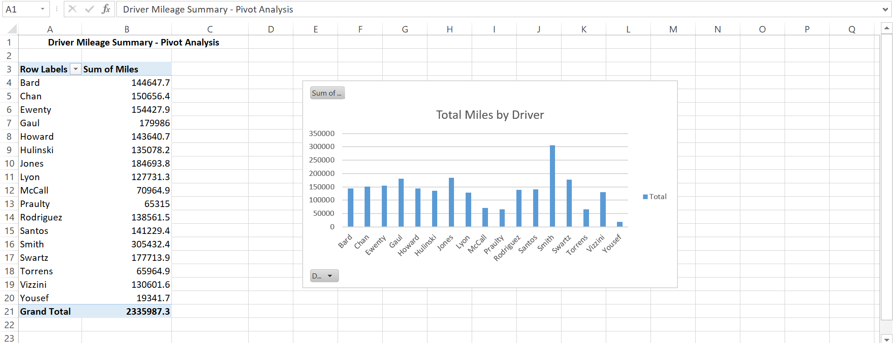

# Car Inventory & Driver Mileage Dashboard

Excel project analyzing car inventory and driver performance using PivotTable and charts.

## Overview
This workbook contains 50+ vehicle records and a PivotTable summary that breaks down total mileage by driver — 2.3M+ miles analyzed.

I cleaned up the raw car inventory and built a driver performance dashboard to see who drives the most.

## What I did
- **Sheet: car inventory** — Raw data: Make, Model, Year, Age, Miles, Color, Driver, Warranty. Includes IF formulas and conditional formatting.
- **Sheet: Sheet1 (Dashboard)** — PivotTable: Sum of Miles by Driver (17 drivers)
- **Charts:** Bar chart - Total Miles by Driver + Scatter plot - Age vs Miles in raw sheet
- **Key insight:** Smith is top driver with 305,432 miles, Grand Total 2,335,987 miles

## Skills Shown
Excel, PivotTables, Data Aggregation, SUM, IF Formulas, Conditional Formatting, Bar Chart, Scatter Plot, Data Analysis

## Files
- car inventory assignment.xlsx — Full workbook with both sheets
- dashboard.png — Pivot dashboard preview (this image)

Built by Mick — Limpopo, South Africa | Exploring Data Analysis
